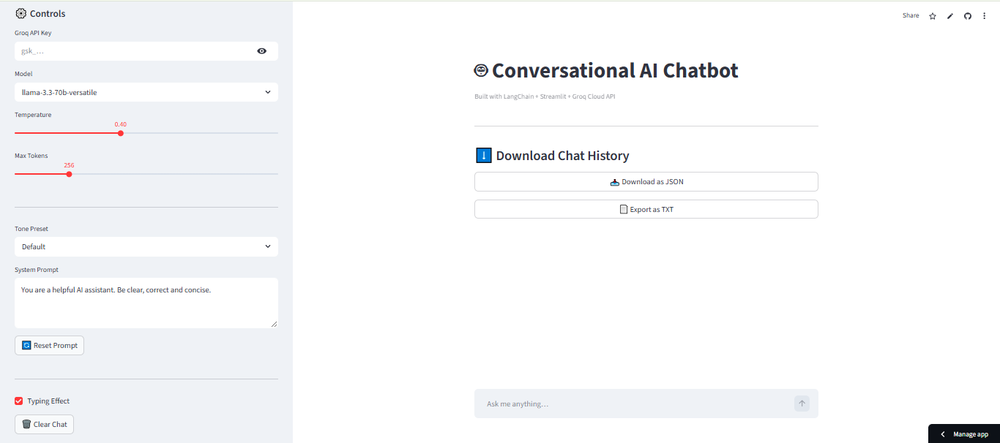
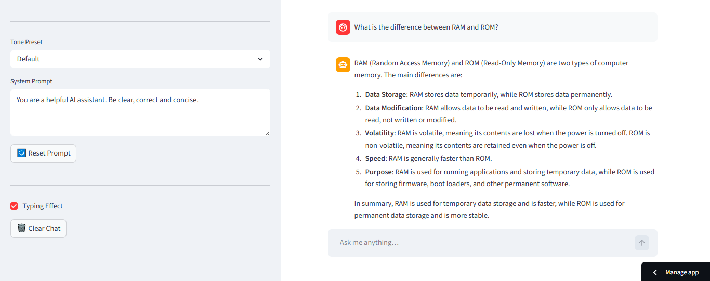
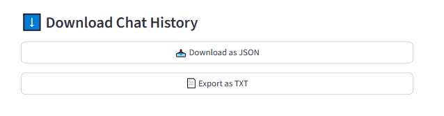
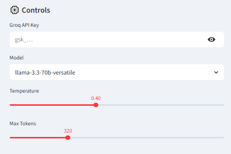
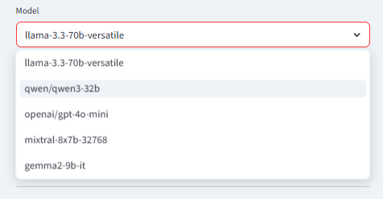

# 🤖 Conversational AI Chatbot

> **A feature-rich conversational chatbot with persistent message history, tone presets, typing effects, and chat export - powered by LangChain, Groq LLM, and Streamlit.**


---

## 🚀 Live Demo
🔗 [View Live App](https://conversational-ai-chatbot.streamlit.app)

---

## 📸 Screenshots






---

## 🧠 Overview
A fully-featured conversational AI chatbot built with **LangChain's RunnableWithMessageHistory** for persistent chat memory. Supports **5 different LLMs** via Groq Cloud API, **4 tone presets**, custom system prompts, typing animation, and chat history export as JSON or TXT.

---

## ✨ Features
- **Persistent chat history** — full conversation memory across turns
- **5 LLM options** — LLaMA3, Qwen, GPT-4o-mini, Mixtral, Gemma2
- **4 tone presets** — Default, Friendly, Strict, Teacher
- **Custom system prompt** — override tone with your own instructions
- **Typing effect** — character-by-character response animation
- **Temperature + Max Tokens** — adjustable from sidebar
- **Export chat** — download as JSON or TXT
- **Clear chat** — reset conversation anytime

---

## 🤖 Supported Models

| Model | Provider |
|---|---|
| llama-3.3-70b-versatile | Meta via Groq |
| qwen/qwen3-32b | Alibaba via Groq |
| openai/gpt-4o-mini | OpenAI via Groq |
| mixtral-8x7b-32768 | Mistral via Groq |
| gemma2-9b-it | Google via Groq |

---

## 🎭 Tone Presets

| Preset | Behavior |
|---|---|
| Default | Clear, correct, and concise |
| Friendly | Warm, enthusiastic, supportive |
| Strict | Formal, direct, facts-only |
| Teacher | Patient, educational, step-by-step |

---

## 🏗️ Architecture
```
User Input
      ↓
ChatPromptTemplate (system prompt + history + user input)
      ↓
RunnableWithMessageHistory (LangChain)
      ↓
Groq LLM (selected model)
      ↓
StrOutputParser → Response
      ↓
InMemoryChatMessageHistory (persisted in session state)
      ↓
Streamlit Chat Interface + Typing Effect
```

---

## 🧰 Tech Stack
| Tool | Purpose |
|---|---|
| LangChain | Conversational chain + message history |
| Groq Cloud API | LLM inference (5 models) |
| Streamlit | Chat interface + deployment |
| python-dotenv | API key management |

---

## 📁 Project Structure
```
conversational-ai-chatbot/
├── app.py              # Full chatbot — LangChain + Streamlit
├── requirements.txt
└── README.md
```

---

## ⚙️ Run Locally
```bash
git clone https://github.com/maryamasifaziz/conversational-ai-chatbot
cd conversational-ai-chatbot
pip install -r requirements.txt
streamlit run app.py
```

Add your Groq API key in `.env`:
```
GROQ_API_KEY=your_groq_api_key
```
Or enter it directly in the app sidebar.

---

## 🔑 Get Your Free Groq API Key
1. Go to **console.groq.com**
2. Sign up free
3. Create an API key
4. Paste it in the sidebar or `.env`

---

## 👤 Author
**Maryam Asif**  
🎓 FAST NUCES  
🔗 [LinkedIn](https://linkedin.com/maryamasifaziz) | [GitHub](https://github.com/maryamasifaziz)
